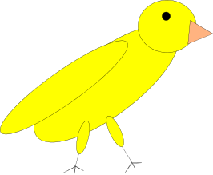

### Canary In A Coal Mine

This is just a test project I use to explore GitHub features, and to make
practice before causing disasters in repositories I care of.

Please ignore it.  

ST

#### Installing

No, you don't want  to.

#### Documentation and examples

This project has a fancy [reference manual](https://stetre.github.io/canary/manual/manual.html)
with [examples](https://stetre.github.io/canary/manual/manual.html#_example) in it.

It also has a [wiki](https://github.com/stetre/canary/wiki).

#### License

The canary is released in a coal mine and under the MIT/X11 license
(the copyright notice is in the LICENSE file in the base directory).

#### Logo

This is the canary:

Isn't it cute? Poor little thing... I really hope it won't get hurt!

#### Previewing

To preview locally this file, and GFM files in general, you can use
[grip](https://github.com/joeyespo/grip).

