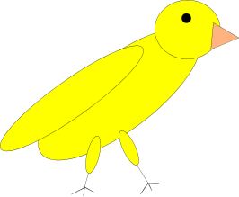

= Canary In A Coal Mine Reference Manual
Doc Author
v1.0, 2015-02-01
:toc: left
:stylesheet: colony.css
:source-highlighter: pygments
:pygments-style: autumn
////
To get a list of pygments styles:
$ pygmentize -L styles

My favourite one is "autumn", but unfortunately it has white parenthesys...
Need to learn how to customize styles (if there is a way to do it).
////

== Introduction

This is the Canary In A Coal Mine Reference Manual.

== Example

[source,lua,indent=1]
----
-- This is an hello world function
function Hello()
  print("Hello World! %u %u %u",1,2,3)
end
----

== Logo
.The canary

Go to the http://github.com/stetre/canary[official-repository].

